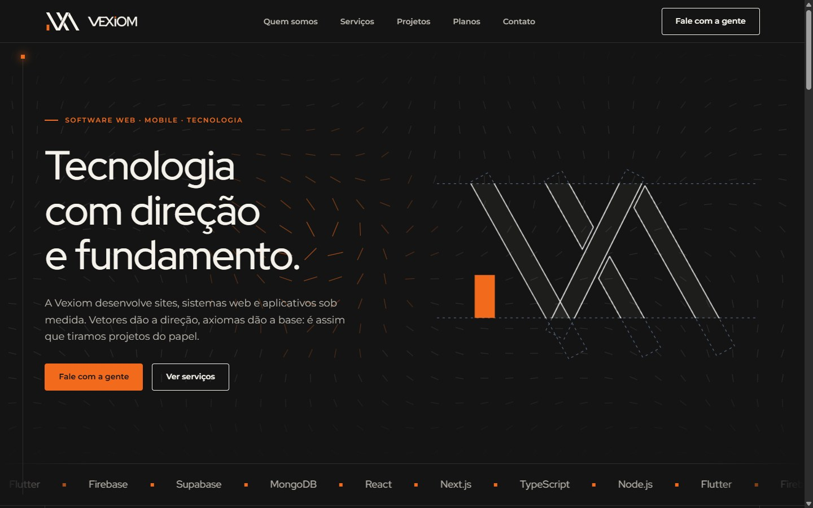
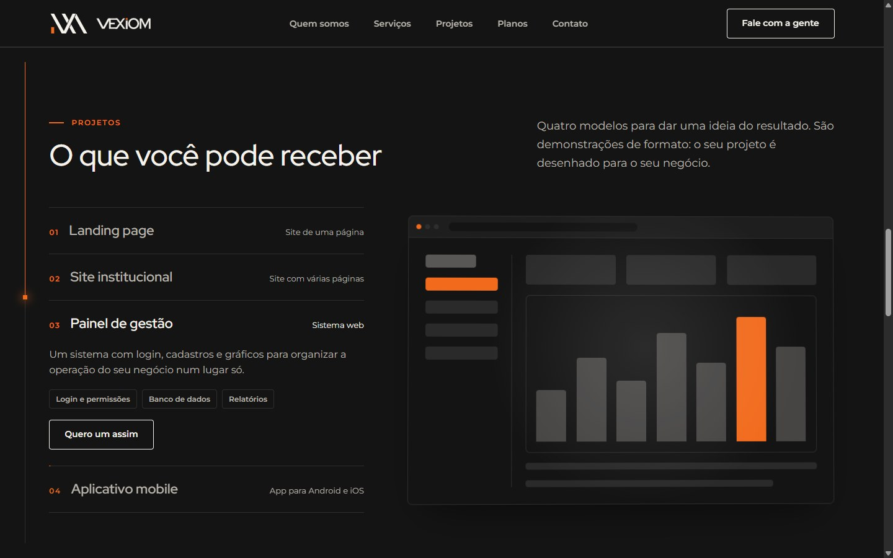
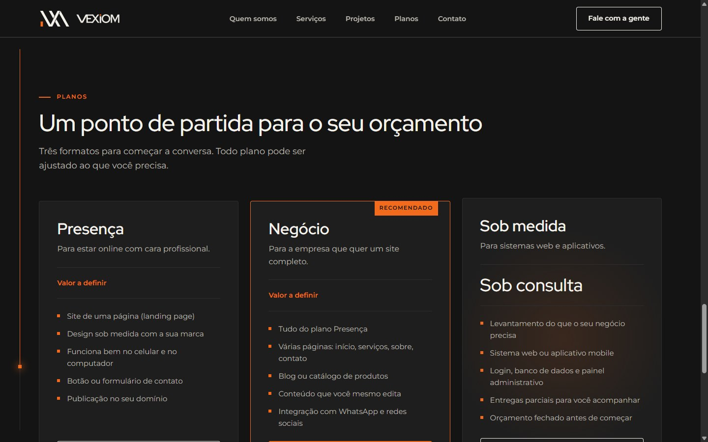
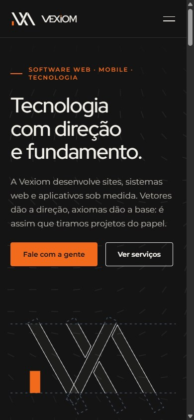
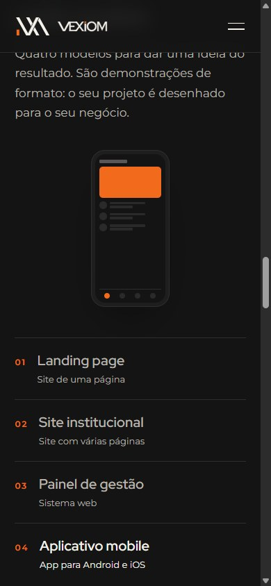

# Vexiom — site institucional

Página de apresentação da **Vexiom**, uma iniciativa de três estudantes de engenharia da UNIFEI para criar uma empresa de tecnologia. O site foi pensado como vitrine: mostrar o que a empresa faz, dar uma ideia do que o cliente recebe e levar até o contato em poucos cliques.



> **Estado do projeto:** estudo de caso encerrado. A Vexiom seguiu com outro site como principal, e este repositório fica como portfólio do que foi construído aqui.

## O que tem no site

- **Hero com campo de vetores.** Um `<canvas>` desenha uma grade de traços que ondulam e giram na direção do cursor. O símbolo da marca se desenha em linhas ao carregar.
- **Vitrine de projetos.** Quatro modelos (landing page, site institucional, painel de gestão e aplicativo) com maquetes feitas só em CSS. A seleção avança sozinha, pausa quando há interação, e a maquete inclina em 3D com o mouse.
- **Planos que levam ao contato.** Escolher um plano rola até a seção de contato, que muda o título e já monta o e-mail com o assunto certo.
- **Movimento ligado à rolagem.** Uma linha lateral acompanha a página, os passos de "Como funciona" acendem em sequência e as seções entram conforme aparecem.
- **Detalhes de interação.** Botões magnéticos, cards com brilho que segue o cursor, faixa de tecnologias em loop, título que entra palavra por palavra.
- **Responsivo e acessível.** Layout fluido do celular ao desktop, menu mobile, foco visível, HTML semântico e respeito à preferência "reduzir movimento" do sistema.





<p align="center">
  
  &nbsp;&nbsp;
  
</p>

## Stack

| Camada | Escolha |
|---|---|
| Framework | Next.js 16 (App Router) + React 19 |
| Linguagem | TypeScript |
| Estilos | CSS Modules + variáveis CSS, sem Tailwind |
| Animação | Motion (`motion/react`) e CSS puro |
| Fontes | Red Hat Display e Montserrat, via `next/font` |
| Qualidade | ESLint, testes manuais com Playwright em desktop e mobile |

## Como rodar

Requer Node.js 20.9 ou mais novo.

```bash
npm install
npm run dev
```

Abra http://localhost:3000. Para a versão de produção:

```bash
npm run build
npm run start
```

## Estrutura

```
src/
├── app/
│   ├── layout.tsx        fontes, SEO e provedores
│   ├── page.tsx          a Home: só empilha as seções
│   └── globals.css       variáveis de tema, tipografia, reset
├── components/
│   ├── *.tsx             uma seção por arquivo, com o .module.css ao lado
│   └── movimento/        efeitos reutilizáveis (cursor, rolagem, canvas)
├── contexts/
│   └── plano.tsx         plano escolhido, compartilhado entre seções
└── content/
    └── site.ts           todos os textos do site
```

Para mudar um texto, edite `src/content/site.ts`. Para mudar cores, edite as variáveis no topo de `src/app/globals.css`.

## Decisões de projeto

- **Servidor por padrão.** As seções são Server Components. Só o que precisa de estado ou de eventos roda no navegador: o menu mobile, a vitrine, os planos, o contato e os efeitos da pasta `movimento/`.
- **Conteúdo separado do layout.** Nenhum texto fica dentro dos componentes; tudo vem de `site.ts`.
- **Tema por variáveis.** Toda cor passa por uma variável CSS. O tema claro (branco e laranja) já está definido em `[data-theme="light"]`, faltando apenas o botão para alternar.
- **Efeitos como componentes.** `Magnetico`, `Inclina`, `Revela`, `CartaoLuz` e os demais embrulham qualquer conteúdo, então as seções continuam simples.
- **Animação barata.** Só `transform` e `opacity` são animados. Valores que mudam a cada quadro usam motion values, sem redesenhar o React. O canvas para de desenhar quando sai da tela.
- **Honestidade no conteúdo.** A empresa ainda não tinha projetos entregues, então a vitrine mostra modelos assumidamente demonstrativos, e não cases inventados.

## O que ficou provisório

- Os planos Presença e Negócio estão sem preço ("Valor a definir").
- Os cards de "Quem somos" estão com nomes e papéis genéricos.
- O contato é feito por link `mailto:`; não há formulário.
- O tema claro não tem alternador na interface.
- Não foi testado em Firefox e Safari nem em aparelhos reais.

## Fluxo de branches

`main` guarda a versão final, `develop` recebe o trabalho em andamento, e cada mudança nasce em `feature/nome` ou `bugfix/nome` e volta para a `develop` por merge.

## Autoria

Projeto de [Leonardo Toledo](https://github.com/Leonardo-Toledo-Alves-Costa), estudante de Engenharia de Computação na UNIFEI. Desenvolvido com apoio do Claude Code (Anthropic) como par de programação: protótipo no Figma, implementação e revisão foram feitos em conjunto, e cada etapa foi documentada como material de estudo.
